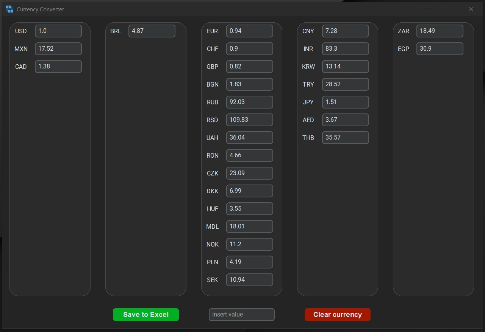
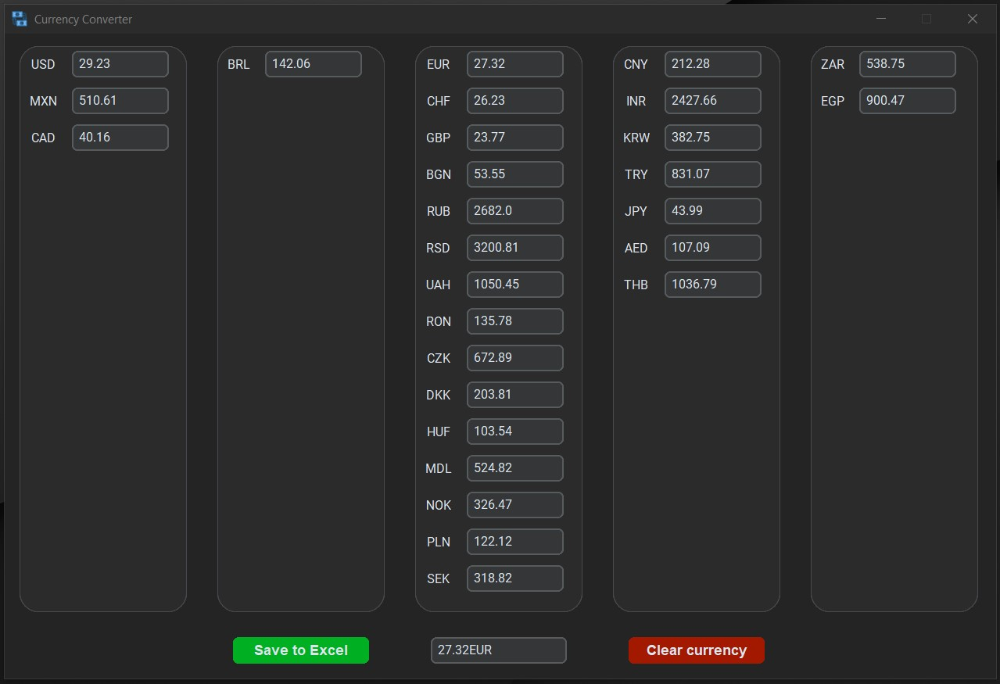
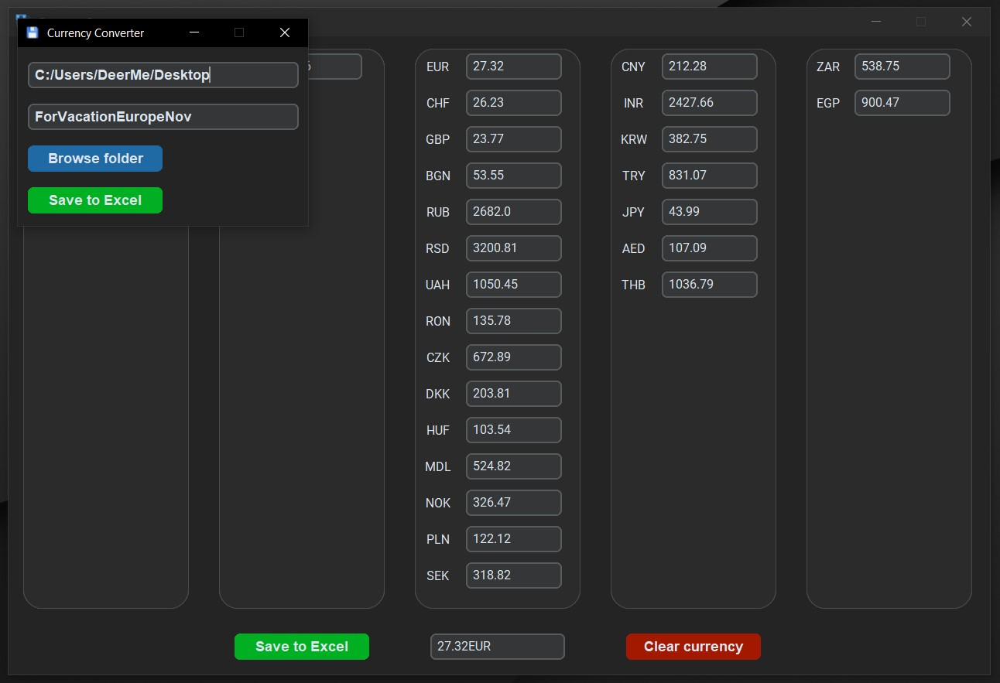
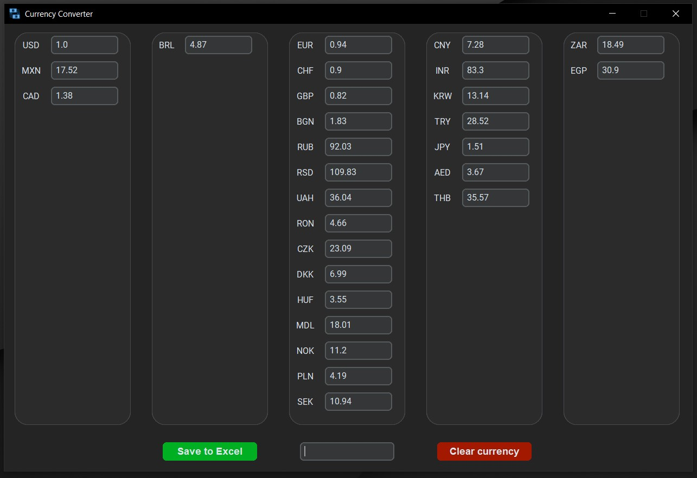

# Currency Converter

Currency Converter is a Python application that allows you to quickly and easily convert between various currencies using up-to-date exchange rates provided by the National Bank of Romania (BNR). This project uses a custom-built graphical user interface (GUI) created with custom tkinter to provide a user-friendly experience.

## Screenshots

    Use the simple interface to view currencies displayed by continent. 
     
    
    

     After converting the requested amount in your desired currency, you can save the data to Excel if needed. 
     
    

     Clear the data with one button and get the raw currency for the day. 
     
    

## YouTube Presentation

## Features

- Real-time exchange rates
- Multi-currency conversion
- Simple and intuitive interface

## Usage

To use CurrencyConverter, follow these steps:

1. Open the program
2. Enter the currency you want to convert in the following form: Amount + Currency (example: 27.34EUR)
3. Press Enter
4. Save the data to Excel if needed or use the Clear button to reset the data to the standard reference currency (USD)

## Major Used Modules/Packages

- Custom Tkinter
- Beautiful Soup

Note: The project is developed using 'Python 3.11.3'

## Installation Guide

1. Open CMD and navigate to the desired path where the project will be located:
> cd /path/to/your/desired/directory

2. Clone the repository:
> git clone https://github.com/edg96/CurrencyConverter

3. Create the virtual environment:
> python -m venv venv

4. Navigate into the project directory:
> cd CurrencyConverter

5. Activate the virtual environment:
- Windows:
> venv\Scripts\activate
- MacOS/ Linux:
> source venv/bin/activate

6. Install the necessary packages and modules from the requirements.txt:
> pip install -r requirements.txt

## License

This project is not under any specific license. It is open for public use and modification. You are free to use, modify, and distribute the code as you see fit. I look forward to any contributions, suggestions, and improvements.

Please note that while this project is open for public use, some third-party dependencies or components might be under certain license agreements.

To check the project dependencies in detail, please read the requirements text file provided in the project.

## Credits

Author: Dragos-Gabriel Enache

Maintainer: Dragos-Gabriel Enache

Email: edragosgabriel@gmail.com

GitHub: https://github.com/edg96

Status: Development temporary suspended. Unit tests are not finished.
